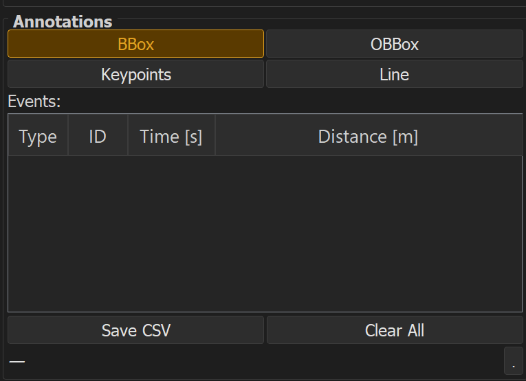

# Annotation

DASexplorer supports four annotation types, each suited to different detection or labeling tasks.

| Type | Use case | Docs |
|---|---|---|
| BBox | Axis-aligned bounding boxes (e.g. object detection) | [BBox](bbox.md) |
| OBBox | Oriented bounding boxes (e.g. angled events) | [OBBox](obbox.md) |
| Keypoints | Point-based labeling (e.g. call onsets) | [Keypoints](keypoints.md) |
| Line | Line-based labeling (e.g. tracked trajectories) | [Line](line.md) |

## General workflow

1. Load a DAS file (see [Reading profiles](../readers/index.md))
2. Select the annotation tool from the toolbar
3. Draw the annotation on the visualization
4. Assign a class label
5. Save annotations, or [export](../export.md) to YOLO / COCO / Raven

!!! tip
    Annotations are saved per session and can be reloaded later for review or correction.
