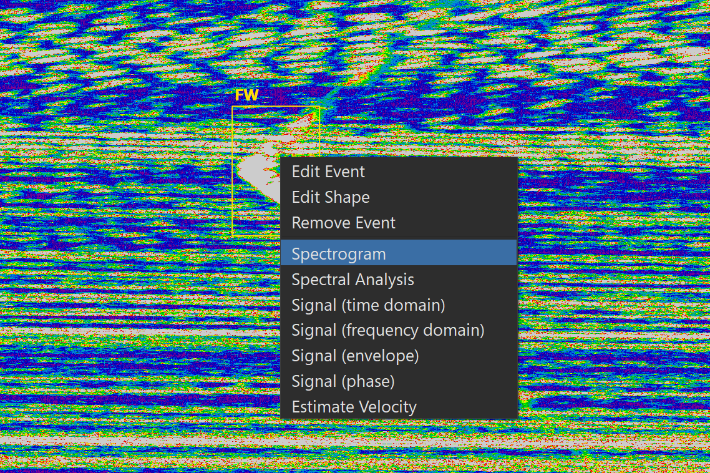
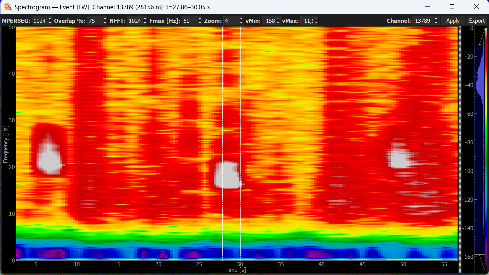
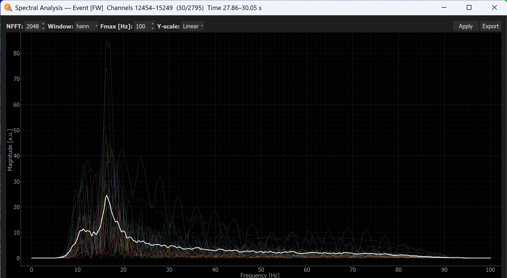
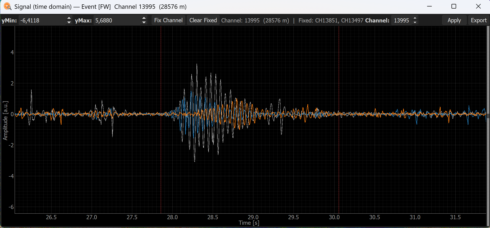
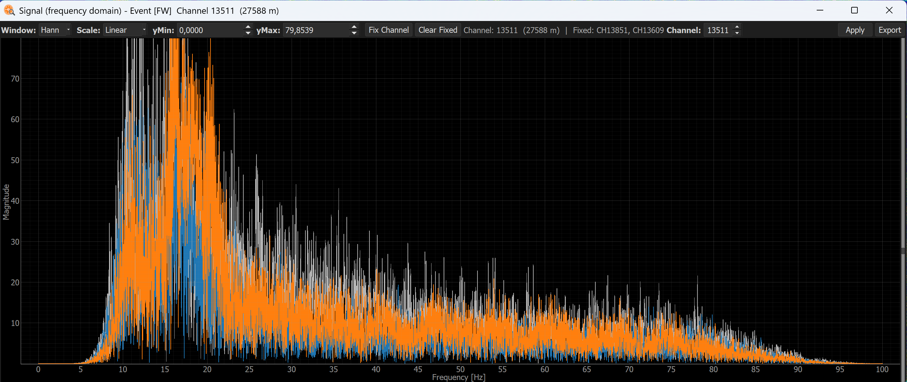
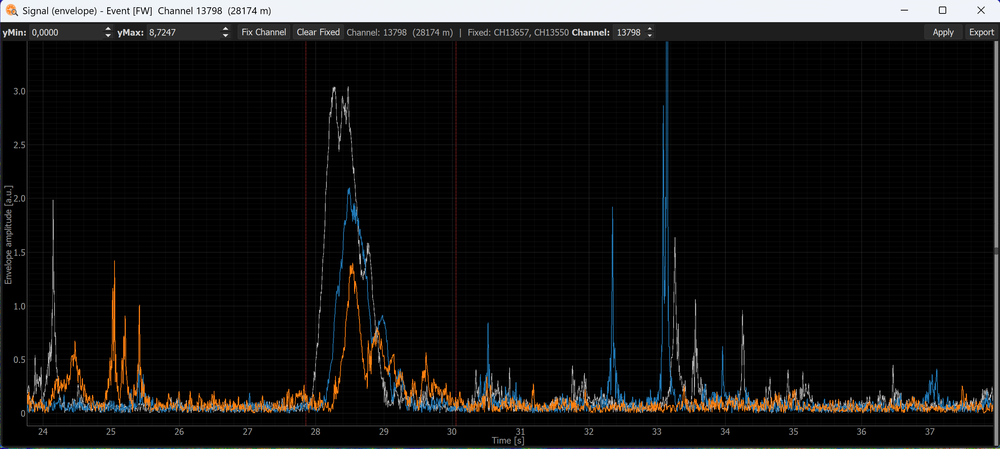
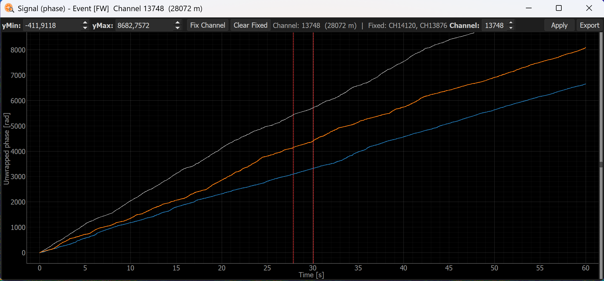
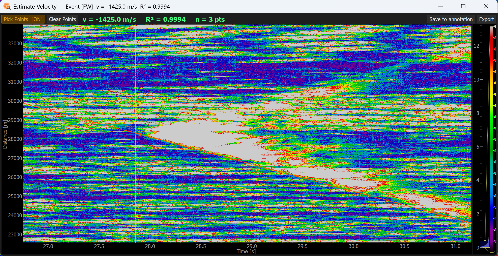

# Analysis tools

Once you have annotated some box-type events (**BBox** or **OBBox**), you can right-click one of them to open a set of basic analysis tools. These tools help you characterize the event and determine which typology it belongs to.

## Available tools

| Tool | What it shows |
|---|---|
| [Spectrogram](#spectrogram) | Time-frequency representation, navigable across channels |
| [Spectral analysis](#spectral-analysis) | Frequency content of the annotated event |
| [Signal (time domain)](#signal-time-domain) | Raw waveform amplitude over time |
| [Signal (frequency domain)](#signal-frequency-domain) | Frequency spectrum of the extracted signal |
| [Signal (envelope)](#signal-envelope) | Amplitude envelope of the signal |
| [Signal (phase)](#signal-phase) | Instantaneous phase of the signal |
| [Estimate Apparent Velocity](#estimate-apparent-velocity) | Apparent propagation velocity of the event |

## Spectrogram

The Spectrogram tool computes a time-frequency representation of the annotated event using the Short-Time Fourier Transform (STFT) with a Hann window, letting you inspect how the spectral content evolves over time.

Unlike the other tools, the Spectrogram is **navigable across channels**: you can step through the spatial channels covered by the annotation to see how the time-frequency pattern changes along the cable, rather than being limited to a single channel or the annotation's average.

!!! tip
    Adjust the overlap, window size, FFT size, maximum frequency, vMin, vMax, and smoothing parameters to optimize the display. Larger windows give better frequency resolution at the cost of time resolution.

## Spectral analysis

The Spectral analysis tool estimates the Power Spectral Density (PSD) of the annotated event using Welch's method, averaged across the channels covered by the annotation. This gives a stable estimate of the frequency content of the event.

## Signal (time domain)

Displays the raw waveform amplitude over time, extracted from the central channel of the annotated event. Useful for inspecting the temporal structure of individual calls or pulses.

## Signal (frequency domain)

Displays the amplitude spectrum of the extracted signal, computed via FFT with a Hann window applied to the full signal length. Complements the Spectral analysis view with a single-shot frequency representation.

## Signal (envelope)

Displays the amplitude envelope of the signal, computed using the Hilbert transform. The envelope tracks the instantaneous amplitude of the signal, making it useful for identifying onsets, duration, and amplitude modulation patterns within the event.

## Signal (phase)

Displays the instantaneous phase of the signal, computed as the argument of the analytic signal via the Hilbert transform. Useful for analyzing phase coherence and propagation characteristics across channels.

## Estimate Apparent Velocity

Estimates the apparent propagation velocity of the annotated event across the cable from its slope in the distance–time (t–x) plane. The user clicks **Pick Points** to enter pick mode, then clicks on the waterfall to place (t, d) pairs. With two or more picks, a linear regression d = v·t + c is computed in real time, the best-fit line is drawn, and the estimated velocity (m/s) and R² are reported.

This is particularly useful for discriminating between different types of events: seismic body waves, surface waves, and acoustic signals all propagate at characteristic velocities that can be used as a classification feature.

!!! note
    This tool is only meaningful for events that show a coherent spatial propagation pattern. Results for stationary or highly scattered events should be interpreted with caution.

!!! tip
    Once satisfied with the velocity estimate, click **Save to annotation** to store the estimated velocity and R² in the annotation CSV for later use.
