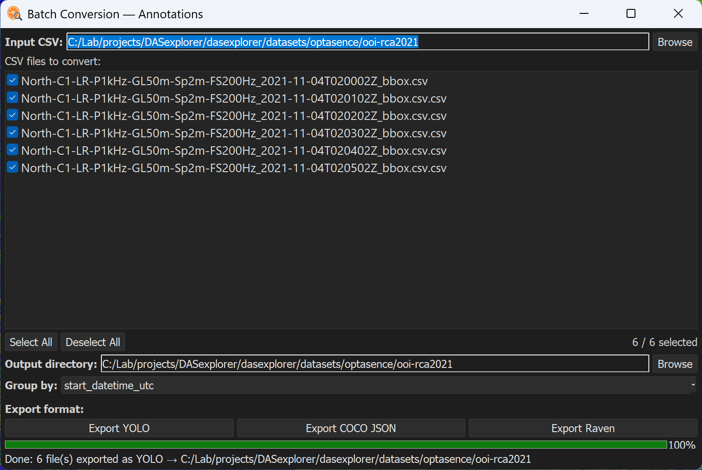
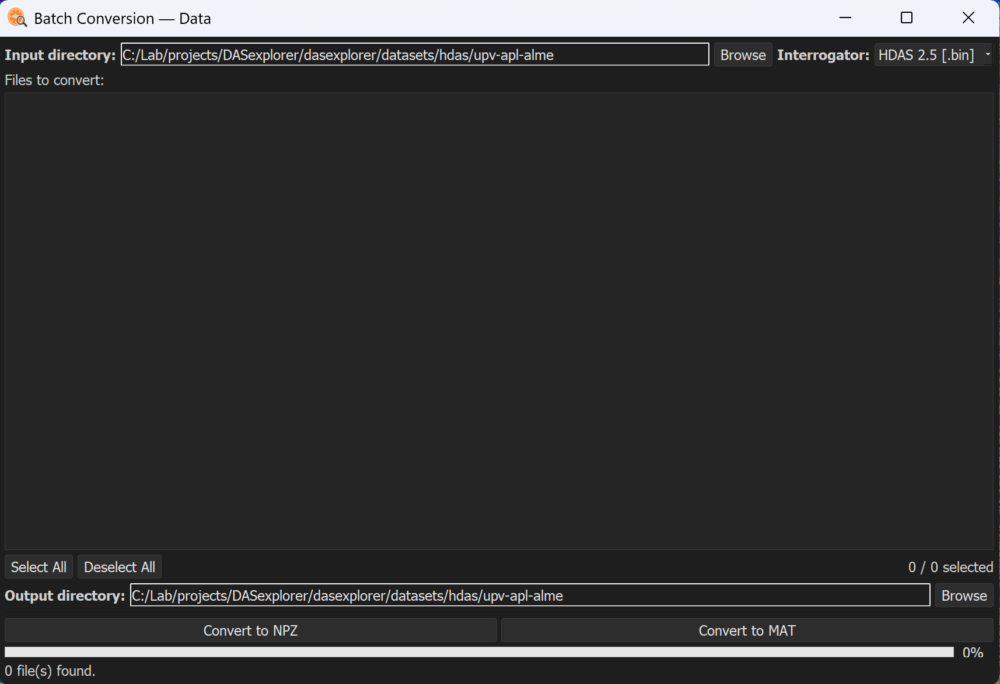

# Batch conversion

Once you have a set of annotations, you can convert them to common formats for training deep learning models and for bioacoustic analysis. Conversion tools are currently provided for **YOLO**, **COCO JSON**, and **Raven** formats.

## Converting annotations

Go to **Conversion > Batch Conversion > Annotations** to open a tool that converts a whole set of annotations at once.

## Converting data

Go to **Conversion > Batch Conversion > Data** to convert an entire directory of DAS data files to **NPZ** or **MAT**, provided you have the read profile needed to load them (see [Built-in reading profiles](readers/index.md)).

