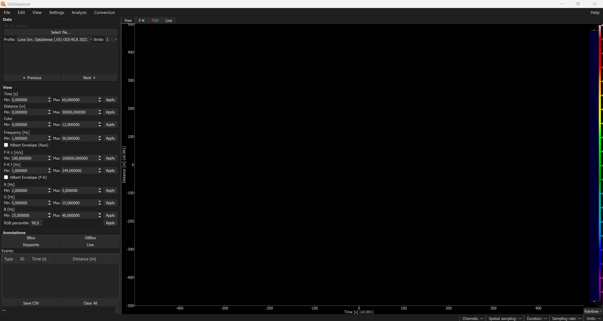
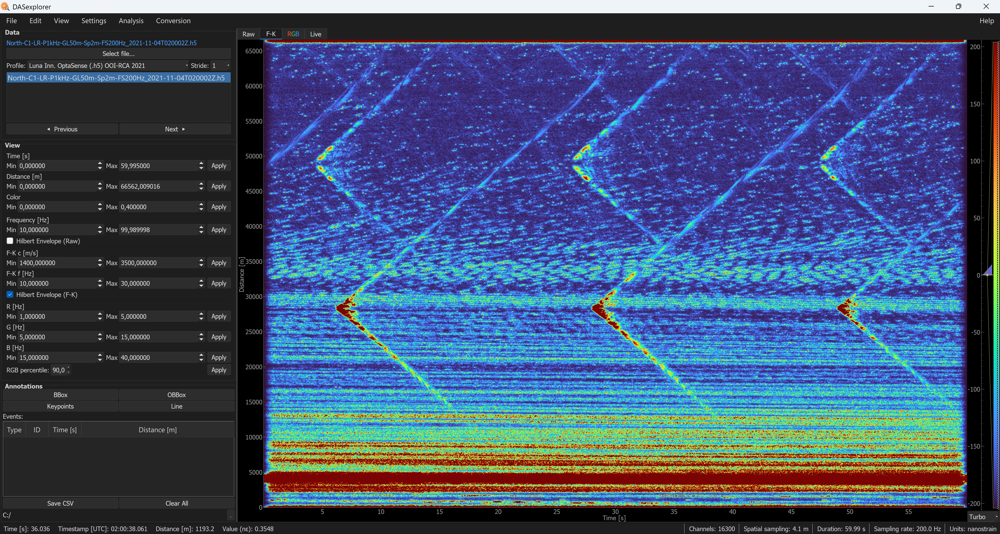
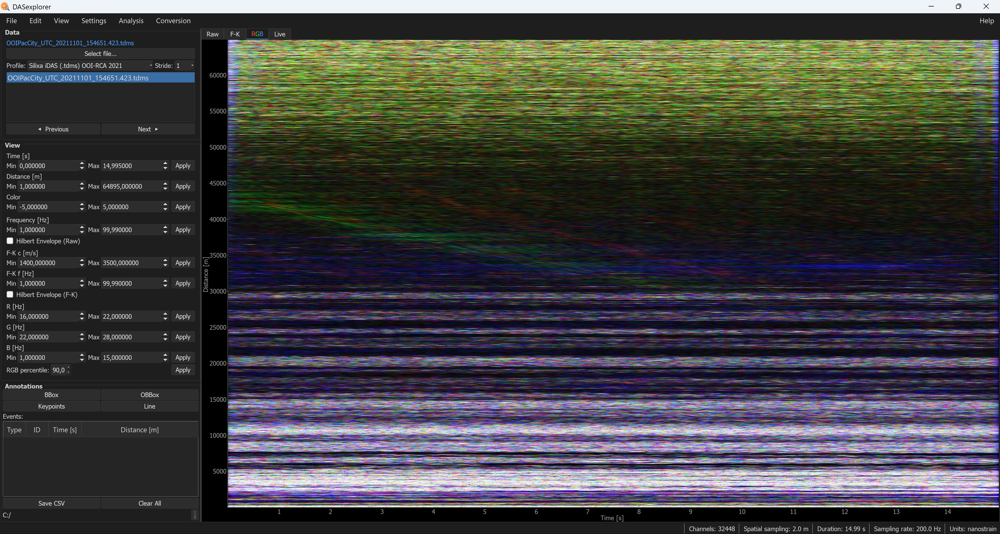
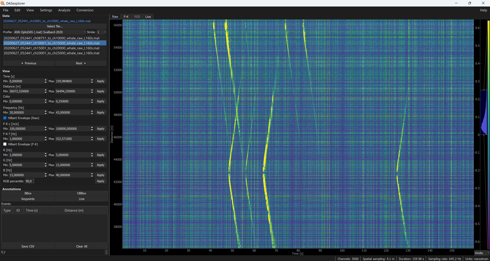

# Getting started

This guide walks through opening your first DAS file in DASexplorer and navigating the main interface.

## Launch the application

Once you have DASexplorer installed, activate the appropriate environment and launch the interface with:

```
dasexplorer
```

## Open a file

1. Select the profile matching your interrogator and data format (see [Reading profiles](readers/index.md))
2. Select a stride value (default `stride=1`). This applies a channel stride (spatial decimation) to reduce memory load
3. Go to **File > Open file...** or press the **Select file...** button



The top-right panel shows the loaded file highlighted in blue. Just below it, you'll see the list of files in that same directory with the same extension. The **Previous** and **Next** buttons let you step backward or forward through the file list. Double-clicking a file in the list loads it.

!!! tip
    Use `read_dmin_m` / `read_dmax_m` in the configuration profile to restrict the spatial range loaded into memory if you don't need to view the full distance range. Setting them to `null` loads the full cable — see [Create reading profiles](profiles.md). Increasing the stride also helps manage memory issues.

## Example datasets

To start experimenting with the interface, we recommend using public example datasets that already have default read profiles configured:

???+ example "OptaSense — OOI Regional Cabled Array (F-K visualization)"
    **Interrogator:** Luna Innovations OptaSense
    **Format:** HDF5 (`.h5`)
    **Dataset:** [Rapid: A Community Test of Distributed Acoustic Sensing on the Ocean Observatories Initiative Regional Cabled Array](https://doi.org/10.58046/5J60-FJ89)
    **Example file:** [North-C1-LR-P1kHz-GL50m-Sp2m-FS200Hz_2021-11-04T020002Z.h5](http://piweb.ooirsn.uw.edu/das/data/Optasense/NorthCable/TransmitFiber/North-C1-LR-P1kHz-GL50m-Sp2m-FS200Hz_2021-11-03T15_06_51-0700North-C1-LR-P1kHz-GL50m-Sp2m-FS200Hz_2021-11-04T020002Z.h5)

    

???+ example "Silixa iDAS — OOI Regional Cabled Array (RGB visualization)"
    **Interrogator:** Silixa iDAS
    **Format:** TDMS (`.tdms`)
    **Dataset:** [Rapid: A Community Test of Distributed Acoustic Sensing on the Ocean Observatories Initiative Regional Cabled Array](https://doi.org/10.58046/5J60-FJ89)
    **Example file:** [OOIPacCity_UTC_20211101_163806.423.tdms](http://piweb.ooirsn.uw.edu/das/data/Silixa/DAS/North65km/acquisition/OOIPacCity_UTC_20211101_163806.423.tdms)

    

???+ example "OptoDAS — Svalbard, Norway (raw visualization)"
    **Interrogator:** Alcatel Submarine Networks OptoDAS
    **Format:** MATLAB (`.mat`), processed
    **Dataset:** [Longyearbyen, Svalbard (Norway) 2020 — DAS4Whales: Svalbard distributed acoustic sensing dataset for baleen whale monitoring](https://zenodo.org/records/5823343)
    **Example file:** [20200627_052441_ch10001_to_ch15000_whale_raw_L160s.mat](https://zenodo.org/records/5823343/files/20200627_052441_ch10001_to_ch15000_whale_raw_L160s.mat?download=1)

    

As you can see, each reading profile sets its own default visualisation values for the left panel — colour scale, bandpass filter range, F-K velocity bounds, RGB frequency bands, and so on. These are loaded automatically when a file is opened with that profile. You can adjust any of them interactively; to reset to the profile defaults, go to **File → Refresh**.

!!! warning "Warning"
    Keep in mind when working with large datasets: processed visualizations (i.e. F-K and RGB) are not precomputed by default, unless specified in the configuration profile. These visualizations are only calculated when you click the **F-K** or **RGB** tab, or press **Apply** on one of their parameters. It is therefore recommended to select the desired visualization values before rendering a processed view.

You can adjust visualization values in the left panel to customize, for example, minimum/maximum time, minimum/maximum distance, dynamic range, band-pass filter, and envelope on/off. If at any point you want to return to the configuration profile's default values, go to **File > Refresh**.


## Channel stride

The **Stride** combo in the top-left panel controls spatial decimation: a stride of N loads every Nth channel, reducing memory use by a factor of N.

- **Stride 1** — all channels (full resolution)
- **Stride 2** — every other channel (half the channels)
- **Stride 10** — one channel in ten (useful for very dense arrays such as Silixa iDAS at 2 m spacing)

The stride can also be changed **after loading** a file. If the new stride is a multiple of the current one, the subsampling is applied in memory instantly. Otherwise, the file is reloaded from disk with the new stride. The status bar at the bottom shows a message when the operation completes.

!!! tip
    For large datasets (tens of thousands of channels), start with a high stride for a quick overview, then reload at stride 1 once you have identified the region of interest.

## Additional information

The bottom-right panel shows the main metadata of the loaded file: Channels, Spatial sampling, Duration, Sampling rate, and Units.

Moving the mouse over the t-x waterfall (bottom left) displays the relative time, timestamp (UTC), distance, and waterfall value at the pointer's location.

!!! warning "Warning"
    When a process is running in the background, information about it is printed at the bottom left. It's recommended to wait until the process finishes to avoid blocking the interface.

The bottom-right panel also has a button showing the current colormap. You can choose between: Rainbow (recommended), Turbo, Grays, Viridis, Magma, and Seismic.

The widget on the right lets you equalize the histogram to adjust the color distribution in your visualization.

## Color themes

You can choose between two themes, "dark" or "light", under **View > Theme**.

## Export raw data

If you want to share an example dataset with a colleague who doesn't use DASexplorer, or want to plot your data in Python or MATLAB, a good way to do this is to export it as NPZ or MAT. To do so, go to:

**File > Save as NPZ** or **File > Save as MAT**

You can re-import these files with **File > Import from NPZ** or **File > Import from MAT**.

