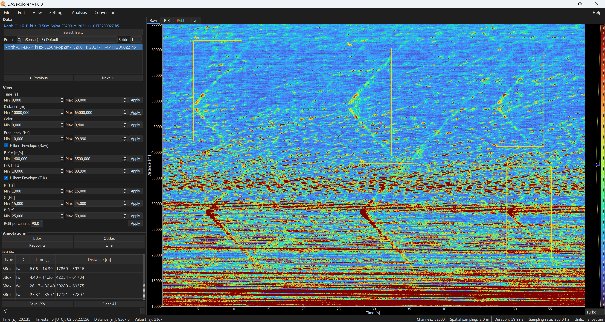

# DASexplorer

**DASexplorer** is an open-source desktop application built for researchers working with Distributed Acoustic Sensing (DAS) data. It provides an integrated environment for loading, visualizing, filtering, and annotating DAS recordings from multiple interrogator systems, without requiring any prior programming knowledge.

DASexplorer was designed for efficient interactive navigation of large DAS datasets. Built on PyQt5 and pyqtgraph, it uses spatial decimation, parameter-based caching, and smart rendering strategies to handle long acquisitions with minimal memory overhead. The application is interrogator-agnostic: a profile-based configuration system maps each acquisition system to its reader, file extensions, and default visualization parameters, making it straightforward to add support for new instruments.

## Features

- Interactive and efficient exploration of t-x DAS files (band-pass filtered, F-K filtered, Hilbert envelope, and RGB representations)
- Support for multiple interrogator formats: ASN OptoDAS, Luna Innovation OptaSence, Aragón Photonics HDAS, Silixa iDAS
- Profile-based configuration system for reproducible workflows and custom formats reading
- Annotation tools: bounding boxes, oriented boxes, keypoints, and lines exportable to common ML formats (YOLO, COCO, Raven)
- Basic analysis tools: spectrogram, spectral analysis of events, phase, envelope and apparent velocity estimation

## Quick links

- [Installation](installation.md)
- [Getting started](getting-started.md)
- [Annotations](annotations.md)
- [Analysis tools](basic-analysis-tools.md)
- [Batch conversion](batch-conversion.md)
- [Create reading profiles](profiles.md)
- [License](license.md)
- [Citation](citation.md)

## Project links

- PyPI: [`pip install dasexplorer`](https://pypi.org/project/dasexplorer/)
- Source code: [GitHub](https://github.com/sermomon/dasexplorer)
- Archived releases: [Zenodo](https://doi.org/10.5281/zenodo.21032550)
- License: GPL v3

## Philosophy

Before adopting DASexplorer, it's worth understanding the design philosophy behind it, to make sure it fits your workflow. This page explains the principles that guide the development of the tool.

### Design principles

- **Minimum-code**: the full analysis workflow is accessible through an intuitive GUI, including F-K filtering, RGB representation, spectral analysis, spectrogram, apparent velocity, phase, and Hilbert envelope. No scripting required to explore your data.

- **Multi-interrogator**: natively supports HDAS 2.5 (Aragón Photonics), OptaSense (Luna Innovations), and OptoDAS (ASN / Alcatel Subsea Networks) file formats, and is extensible to new systems through its profile-based reader architecture.

- **Research-ready**: exports data and annotations in formats directly usable by machine learning and bioacoustic analysis pipelines — NPZ, MAT, YOLO, COCO JSON, and Raven Pro — so results flow straight into your existing tooling.

- **Open source**: DASexplorer is free and open software, released under the GPL v3 license, that can be customized for specific purposes and improved by the community.

