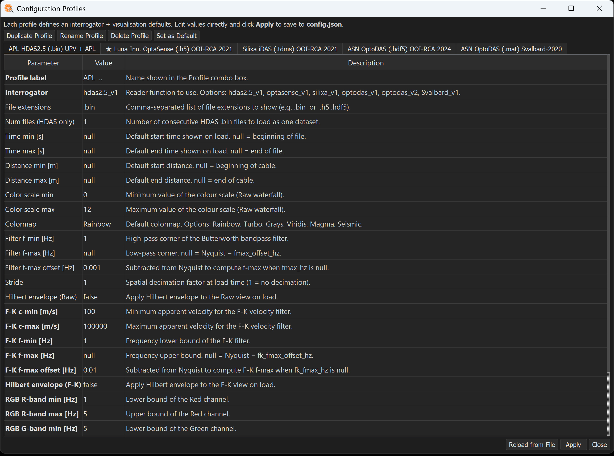

# Adding a reading profile

DASexplorer is interrogator-agnostic: support for a new acquisition system is added through a **reader function** plus a **profile entry** in `config.json`, without touching the rest of the application. This makes it straightforward to add new readers gradually, including contributions from the community.

Not sure what a reading profile is? See [What is a reading profile?](what-is-a-profile.md)

---

## Step 1 — Write a reader function

A reader function takes the path to a file and returns a `DASDataset` object. The standard signature is:

```python
def read_myreader_v1(
    path: str,
    stride: Optional[int] = None,
    read_dmin_m: Optional[float] = None,
    read_dmax_m: Optional[float] = None,
    **kwargs,
) -> DASDataset:
```

The `DASDataset` must contain at least:

| Field | Type | Description |
|---|---|---|
| `tr` | `np.ndarray` | Strain-rate array, shape `(n_channels, n_time)` |
| `dist_m` | `np.ndarray` | Along-cable distance axis [m] |
| `time_s` | `np.ndarray` | Time axis relative to file start [s] |
| `fs_hz` | `float` | Sampling frequency [Hz] |
| `start_datetime_utc` | `datetime \| None` | UTC timestamp of the first sample |
| `filename` | `str` | Original file name (basename only) |
| `reader` | `str` | Reader key — must match the key used in `READERS` and `config.json` |
| `downsample` | `int \| None` | Channel stride applied at load time, or `None` |
| `channel_offset` | `int` | Index of the first loaded channel in the original cable (stride=1, no crop). Use `0` if no spatial crop is applied. |
| `metadata` | `dict` | Any additional format-specific information |
| `units` | `str` | Physical units of `tr` (e.g. `"nanostrain"`, `"DC"`, `"rad/(s*m)"`) |

A minimal reader looks like this:

```python
def read_myreader_v1(
    path: str,
    stride: Optional[int] = None,
    read_dmin_m: Optional[float] = None,
    read_dmax_m: Optional[float] = None,
    **kwargs,
) -> DASDataset:
    
    # ... Your reading logic here ...

    return DASDataset(
        tr=tr,
        dist_m=dist_m,
        time_s=time_s,
        fs_hz=fs_hz,
        start_datetime_utc=start_dt,
        filename=os.path.basename(path),
        reader="myreader_v1",
        downsample=downsample,
        channel_offset=channel_offset,
        metadata={"key": "value"},
        units="nanostrain",
    )
```

Save the reader in `core/readers_lib/` alongside the other reader modules. Use a descriptive filename such as `myinterrogator.py`.

!!! tip
    Not sure where `core/readers_lib/` lives on your system? Run:
    ```
    python -c "import dasexplorer, os; print(os.path.join(os.path.dirname(dasexplorer.__file__), 'core', 'readers_lib'))"
    ```
    Since this involves modifying the package source, you will need an **editable install** (`pip install -e .` from a local clone). See [Installation — with git](installation.md#with-git).

---

## Step 2 — Register your reader

Open `core/readers.py` and add two lines: one import and one entry in the `READERS` dictionary.

```python
from dasexplorer.core.readers_lib.myinterrogator import read_myreader_v1 # Add this

READERS = {
    "hdas2.5_v1":   read_hdas25_v1,
    "optasense_v1": read_optasense_v1,
    # ...
    "myreader_v1":  read_myreader_v1,   # Add this
}
```

`READER_TYPES` and `READER_LABELS` are derived automatically from `READERS` and `config.json` — no additional lists to maintain.

---

## Step 3 — Add a profile to `config.json`

Add an entry under `"profiles"` in `config.json`. You can do this in two ways:

- **From the GUI:** go to **Settings → Configuration Profiles**, duplicate an existing profile, rename it and edit its fields.



- **By editing `config.json` directly.**

??? question "config.json"
    ```json
    "myreader_v1": {
        "label": "MyInterrogator (.ext) Description",
        "reader": "myreader_v1",
        "file_extensions": [".ext"],
        "tmin_s": null,
        "tmax_s": null,
        "dmin_m": null,
        "dmax_m": null,
        "read_dmin_m": null,
        "read_dmax_m": null,
        "vmin": 0.0,
        "vmax": 0.5,
        "colormap": "Rainbow",
        "fmin_hz": 1.0,
        "fmax_hz": null,
        "fmax_offset_hz": 0.01,
        "stride": 1,
        "envelope": false,
        "fk_cmin_ms": 1400.0,
        "fk_cmax_ms": 3500.0,
        "fk_fmin_hz": 1.0,
        "fk_fmax_hz": null,
        "fk_fmax_offset_hz": 0.01,
        "fk_envelope": false,
        "default_view": "raw",
        "rgb_rmin_hz": 1.0,
        "rgb_rmax_hz": 10.0,
        "rgb_gmin_hz": 10.0,
        "rgb_gmax_hz": 30.0,
        "rgb_bmin_hz": 30.0,
        "rgb_bmax_hz": 50.0,
        "rgb_percentile": 90.0
    }
    ```

The `"reader"` field must match the key used in `READERS` exactly.

!!! tip
    Not sure where `config.json` lives on your system? Run:
    ```
    python -c "import dasexplorer, os; print(os.path.join(os.path.dirname(dasexplorer.__file__), 'cfg', 'config.json'))"
    ```
